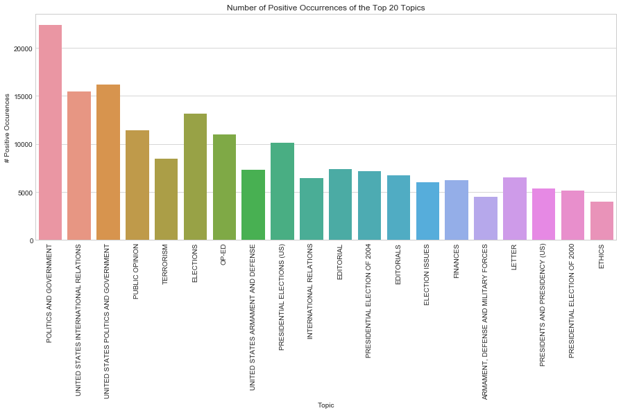
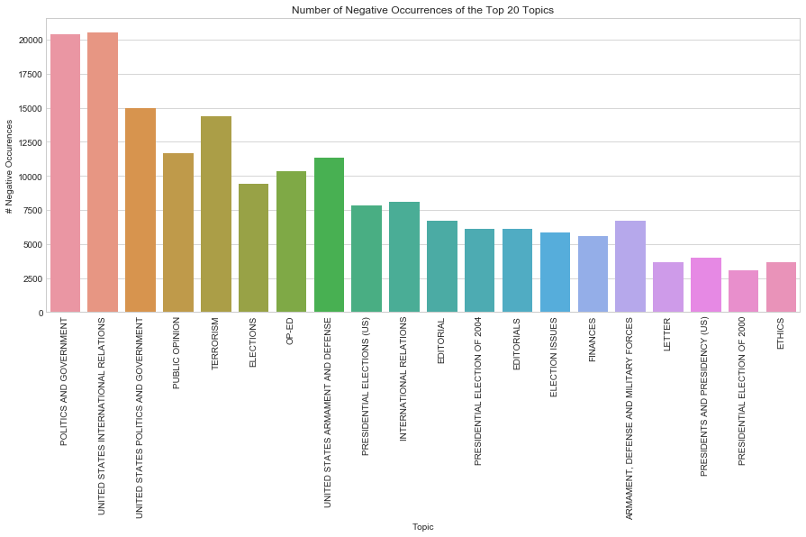
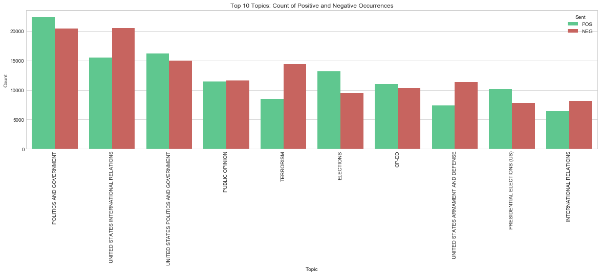

# Sentiment Analysis of Figures in the New York Times
Christopher Lagunilla
---

## Introduction  
This project seeks to find summary statistics and descriptive data related to sentiment. Sentiment is an interesting idea to explore since it can be closely related to time and historical events and thus can fluctuate throughout a year, or over many years. Additionally, different people will have different sentiments about them depending on what kinds of stories they happen to be mentioned in. By looking at editorial and opinion articles, we can look at what ways journalists are presenting particular figures.  

The code explores a number of questions discussed below regarding prominent figures from the early 2000s, using sentiment analysis tools to answer them.

## Data Source
The data source used for this project is the New York Times Annotated Corpus, licensed by the Linguistic Data Consortium. The files, having already been nicely cleaned and noted, made data collection more simple than to scrape the internet for similar data. Thus, my tasks related to the data involved getting data from a well-defined data structure using additional Python libraries.

The original plan of the project was to utilize Times magazine rather than the New York Times. However, the articles from Times magazine were not collected as a corpus, and to acquire them over time required multiple payments. Thus, the project plan was amended to use the NYT corpus. This change actually helped the project overall, in that it would be easier to define opinion based articles to use for analysis, due to the well-defined structure.

## Data Capturing
The data capturing process occurs in `unpack.ipynb`. The first task was to leverage Python libraries to parse the .xml files into a usable object which can be traversed. This made capturing particular fields of data quite simple using xpaths. Some of the important information that was captured from each file included: day, month, year, article text, names mentioned, and topic information. Each of these entries (one for each person mentioned) were appended to a regular Python dictionary, and later converted to a Pandas DataFrame for easier processing later.

> One of the issues faced in the beginning was that of efficiency and code execution time. The original implementation of the code created an empty DataFrame, and appended each row to it as they were captured from the XML files. This proved to be quite slow, and unreasonable to continue using. After looking into the implementation of the Pandas append() function, I learned that DataFrames are immutable, and executing `df = df.append(...)` would repeatedly create new DataFrames, wasting time and memory. Thus, the solution to store information as a dictionary object first and convert to a DataFrame later proved to be much more efficient.

Once the DataFrame is created, the file is serialized into a file using the `pickle` library, allowing for easier access.

The final step to capturing the appropriate data was to use the `glob` library in order to loop through _all_ the relevant XML files using regular expressions. Instead of having to run the `unpack.ipynb` code for each file (of which there are many), it can be run once, with defined parameters regarding what days, months, or years are to be captured.

> Another issue that came up during the capturing process is regarding the files contained within the year 2006. The code does not seem to recognize the path to the files contained in the 2006 folder, however the code works for every other year. Thus files from the year 2006 are not present in the analysis.

## Data Processing
Data processing and analysis occurs in the `processing_and_analysis.ipynb` file. Once data was collected from the files generated by `unpack.ipynb`, the data was loaded into DataFrames. This was the structure used to manipulate and operate on the information.

Visualization of results were generated leveraging the `seaborn` library.

Sentiment analysis is done using VADER (Valence Aware Dictionary and sEntiment Reasoner). VADER assesses a text and provides "polarity scores", rating the positive, negative, and neutral sentiments of the document. Additionally, the pos, neg, and neu values are combined into a single metric called `compound` which places the three statistics on a scale from [-1, 1].

> One of the notes about VADER is that it was initially designed to work with social media posts. Specificities about punctuation, modifier words, and emoji usage factor into its calculations. This may prove to be problematic in evaluating newspapers. This fact influenced the decision to filter out and only use opinion based articles, since well crafted news articles are likely to be neutral anyways. Read more about VADER [here](http://t-redactyl.io/blog/2017/04/using-vader-to-handle-sentiment-analysis-with-social-media-text.html).

## Analysis
__1. Who are the Top 10 mentioned people?__  
The first exploratory question was to simply find the Top 10 people who are mentioned in the given data. The `opinions` DataFrame carries all of the data for the project. [Here](https://github.com/Data-Science-for-Linguists/NYT_Figures_Sentiment_Analysis/blob/master/jupyter_notebooks/processing_and_analysis/processing_and_analysis.md#use-groupby-to-aggregate-count-statistics), subset of this data is taken by using the pandas `groupby()` function on the parameter 'Name'. The `describe()` function aggregates descriptive statistics such as percentiles and count. I was interested in the 'Count', and sorted the rows based on that value.

The [results](https://github.com/Data-Science-for-Linguists/NYT_Figures_Sentiment_Analysis/blob/master/jupyter_notebooks/processing_and_analysis/processing_and_analysis.md#collect-count-statistics-for-top-10) showed me that, between 2000-2007, George W. Bush was the top 3 mentions in the New York Times. He was mentioned a total of 7,505 times, and his average sentiment was 0.3. This indicates that his average article is neutral, slightly positive.

After [visualizing](https://github.com/Data-Science-for-Linguists/NYT_Figures_Sentiment_Analysis/blob/master/jupyter_notebooks/processing_and_analysis/processing_and_analysis.md#visualize-sentiment-scores-for-top-10) the remaining Top 10 mentions, the people with an average sentiment which was positive were George W. Bush (as Governor of Texas), Al Gore (as V.P.), and John Kerry (as Senator).

> One of the things I realized while writing this code was that certain figures who have held multiple prominent positions are listed separately. Example: George W. Bush as President, Governor, and without title. I originally thought to find a way to combine these, however I decided to keep them separately, since a person's actions in a specific role are distinct from the others given the social context of their occupation.

__2. What topics are associated with positive articles? What topics are negative articles?__  
The next question to explore is what are the Top 20 topics, and how of them occur in positive and negative articles.

I first had to [grab](https://github.com/Data-Science-for-Linguists/NYT_Figures_Sentiment_Analysis/blob/master/jupyter_notebooks/processing_and_analysis/processing_and_analysis.md#split-the-opinions-dataframe-into-pos-and-neg-dataframes) a subset of `opinions` which contained a positive compound score. Then I [created](https://github.com/Data-Science-for-Linguists/NYT_Figures_Sentiment_Analysis/blob/master/jupyter_notebooks/processing_and_analysis/processing_and_analysis.md#gather-topics-and-counts-from-pos_topics--convert-to-dataframe) a dictionary of topics as a key and a count as the value. By looping through each of the topics I was able to gather the topics associated with a positive sentiment. The same was [repeated](https://github.com/Data-Science-for-Linguists/NYT_Figures_Sentiment_Analysis/blob/master/jupyter_notebooks/processing_and_analysis/processing_and_analysis.md#gather-topics-and-counts-from-neg_topics--convert-to-dataframe) with negative articles.

I was then able to [merge](https://github.com/Data-Science-for-Linguists/NYT_Figures_Sentiment_Analysis/blob/master/jupyter_notebooks/processing_and_analysis/processing_and_analysis.md#aggregate-positive-and-negative-topic-counts-together) the two DataFrames back into one, having restructured the data they contain.

Using the data, I was able to plot positive and negative occurrences of the Top 20 topics.

And after some tweaking, created a plot of the two together.

Doing this showed me that the most discussed topics are related to politics and government, which makes sense given that they are the most charged topics and are more likely to be argued and written about.

One interesting observation is the topic "United States International Relations", which has ~50,000 more negative mentions than positive ones. Perhaps this says something about the state of the United States at this time?

__3. What words are associated with positive articles? What words are associated with negative words?__  
Following these [steps](http://www.nltk.org/book/ch06.html) to generate a Naive-Bayes classifier using nltk, I was able to discover what the [most informative feature words](https://github.com/Data-Science-for-Linguists/NYT_Figures_Sentiment_Analysis/blob/master/jupyter_notebooks/processing_and_analysis/processing_and_analysis.md#get-the-most-informative-features-from-the-classifier) are from this data in identifying a positive or negative article.

With an [accuracy score](https://github.com/Data-Science-for-Linguists/NYT_Figures_Sentiment_Analysis/blob/master/jupyter_notebooks/processing_and_analysis/processing_and_analysis.md#measure-accuracy-of-naive-bayes-classifier) of 0.90, the most informative feature word for negative articles are:
- killing
- prisoner
- crime  

and the most informative positive words are:
- recommend
- lovely
- enjoying

__4. Are there particular months that harbor a particular sentiment?__  
The final question I wish to explore is similar to (1), however I wanted to see if there was a tendency for particular months to have a certain sentiment. By performing [`groupby()`](https://github.com/Data-Science-for-Linguists/NYT_Figures_Sentiment_Analysis/blob/master/jupyter_notebooks/processing_and_analysis/processing_and_analysis.md#group-opinions-by-months) operation on months, I am able to gather the count data and mean sentiment scores for each month.

The results from the data are visualized below.

From the graph, we can see that April and May averages a negative-neutral average score. March is near zero, but slightly positive. The remaining months seem to have a higher average than the others.

After [peeking](https://github.com/Data-Science-for-Linguists/NYT_Figures_Sentiment_Analysis/blob/master/jupyter_notebooks/processing_and_analysis/processing_and_analysis.md#peek-at-the-articles-from-april-4-and-may-5) some of the April and May articles, I was able to see some of the topics such as United States International Relations, Terrorism, Economics, amongst others. These have proven to skew more negatively as seen in prior analyses.

## Future Exploration
Some of the future tasks I would like to see this project taken is to define a particular set of topics, and use VADER on social media posts like Twitter. Because VADER was designed and trained for social media posts, it could present more accurate information. Additionally, with the right code, analyses code be modified live as more tweets on a particular topic are posted.
