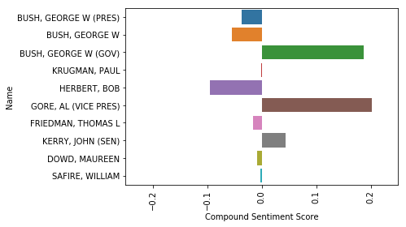
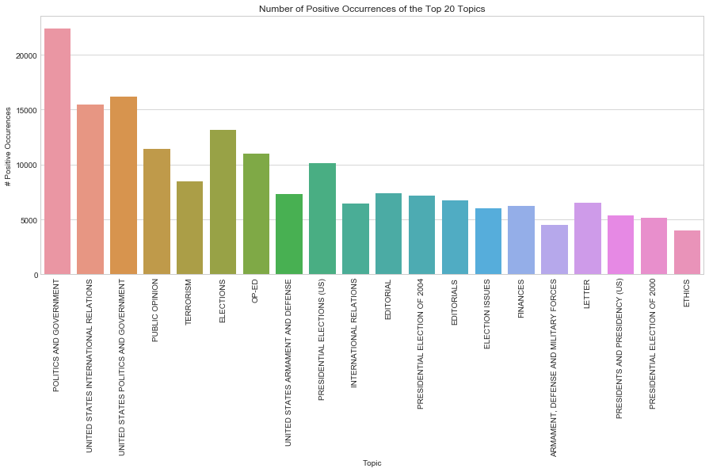
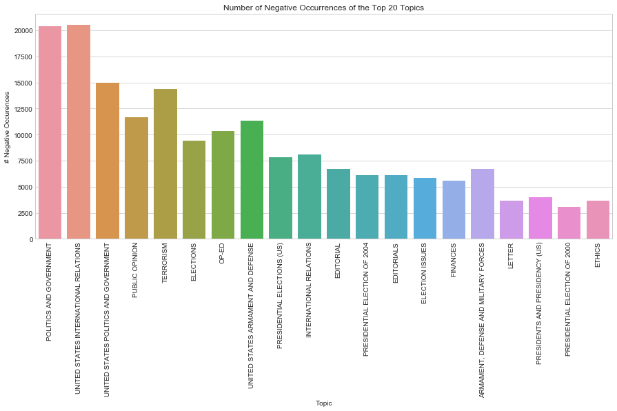
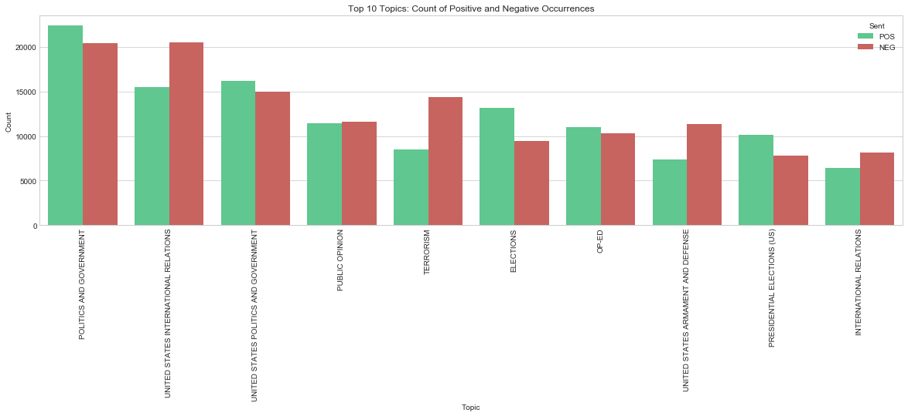
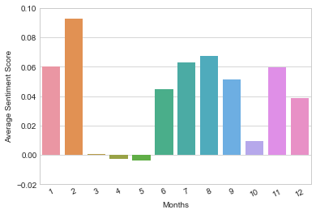

# Processing & Analysis
The code contained in this jupyter notebook will handle much if not most of the processing of the information gathered from `unpack.ipynb`. The code will assume that files have been generated from that script, following the regex pattern `"nyt-*.p"`  

At least one of these files are necessary to run, but the processing will provide best results if multiple are used.


### Table of Contents
- [Turn On Ability To See Multiple Outputs](#Turn-On-Ability-To-See-Multiple-Outputs)
- [Import Necessary Libraries](#Import-Necessary-Libraries)
- [Import List Created in focus_group.ipynb](#Import-List-Created-in-focus_group.ipynb)
- [Get Data from nyt-*.p Files For Each Person](#Get-Data-from-nyt-*.p-Files-For-Each-Person)
- [Get Opinion/Editoral Articles](#Get-Opinion/Editoral-Articles)
- [Remove Unusable Rows From opinion](#Remove-Unusable-Rows-From-opinion)
- [Apply a Function to Calculate Sentiment of Each Document Using VADER](#Apply-a-Function-to-Calculate-Sentiment-of-Each-Document-Using-VADER)
- [Use GroupBy to Aggregate Count Statistics](#Use-GroupBy-to-Aggregate-Count-Statistics)  

---

- [Who are the Top 10 Mentioned Names?](#Who-are-the-Top-10-Mentioned-Names?)
    - [Collect Count Statistics for Top 10](#Collect-Count-Statistics-for-Top-10)
    - [Visualize Sentiment Scores for Top 10](#Visualize-Sentiment-Scores-for-Top-10)

---

- [What Topics are Associated with Positive articles? Negative?](#What-Topics-are-Associated-with-Positive-Articles-Negative?)
    - [Split the opinions DataFrame into POS and NEG DataFrames](#Split-the-opinions-DataFrame-into-POS-and-NEG-DataFrames)
    - [Gather Topics and Counts from pos_topics & Convert to DataFrame](#Gather-Topics-and-Counts-from-pos_topics-&-Convert-to-DataFrame)
    - [Gather Topics and Counts from neg_topics & Convert to DataFrame](#Gather-Topics-and-Counts-from-neg_topics-&-Convert-to-DataFrame)
    - [Aggregate Positive and Negative Topic Counts Together](#Aggregate-Positive-and-Negative-Topic-Counts-Together)
    - [Plot Counts of Positive Occurences of Top 20 Topics](#Plot-Counts-of-Positive-Occurences-of-Top-20-Topics)
    - [Plot Counts of Negative Occurences of Top 20 Topics](#Plot-Counts-of-Negative-Occurences-of-Top-20-Topics)
    - [Merge the Resulting pos and neg DataFrames into a Single topics DataFrame to Create Side-by-Side Bar Chart](#Merge-the-Resulting-pos-and-neg-DataFrames-into-a-Single-topics-DataFrame-to-Create-Side-by-Side-Bar-Chart)
    - [Visualize Side-by-Side POS and NEG data](#Visualize-Side-by-Side-POS-and-NEG-data)

---

- [What Are Common Feature Words in Negative Articles? What Are Common Words in Positive Articles?](#What-Are-Common-Feature-Words-in-Negative-Articles?-What-Are-Common-Words-in-Positive-Articles?)
    - [Collect and Tag Articles From pos_docs and neg_docs that Were Created Above](#Collect-and-Tag-Articles-From-pos_docs-and-neg_docs-that-Were-Created-Above)
    - [Create a Function to Extract Word Features](#Create-a-Function-to-Extract-Word-Features)
    - [Create a Feature Set for Sentiments](#Create-a-Feature-Set-for-Sentiments)
    - [Split feature_sets into a Training and Test Set](#Split-feature_sets-into-a-Training-and-Test-Set)
    - [Create the Naive-Bayes Classifier and Train It](#Create-the-Naive-Bayes-Classifier-and-Train-It)
    - [Measure Accuracy of Naive-Bayes Classifier](#Measure-Accuracy-of-Naive-Bayes-Classifier)
    - [Get the Most Informative Features From the Classifier](#Get-the-Most-Informative-Features-From-the-Classifier)

---    

- [Is There a Pattern Between Month and Sentiment?](#Is-There-a-Pattern-Between-Month-and-Sentiment?)
    - [Group opinions by Months](#Group-opinions-by-Months)
    - [Visualize Sentiment Averages over Months](#Visualize-Sentiment-Averages-over-Months)
    - [Peek at the Articles from April (4) and May (5)](#Peek-at-the-Articles-from-April-4-and-May-5)

### Turn On Ability To See Multiple Outputs


```python
from IPython.core.interactiveshell import InteractiveShell
InteractiveShell.ast_node_interactivity = "all"
```

### Import Necessary Libraries


```python
import xml.etree.ElementTree as Et
import glob
import pandas as pd
import nltk
from nltk.corpus import stopwords
import pickle
from nltk.sentiment.vader import SentimentIntensityAnalyzer
import seaborn as sns
import matplotlib.pyplot as plt
from pprint import pprint
from random import shuffle
```

    /Library/Frameworks/Python.framework/Versions/3.6/lib/python3.6/site-packages/nltk/twitter/__init__.py:20: UserWarning: The twython library has not been installed. Some functionality from the twitter package will not be available.
      warnings.warn("The twython library has not been installed. "


### Import List Created in `focus_group.ipynb`


```python
names = pickle.load(open("poi.p", "rb"))
names
```


    ['TRUMP, DONALD',
     'OBAMA, BARACK',
     'BUSH, GEORGE W.',
     'CLINTON, BILL',
     'BUSH, GEORGE H.W.',
     'REAGAN, RONALD']


### Get Data from `nyt-*.p` Files For Each Person


```python
names_df = {}
```


```python
for name in names:
    df = None
    for file in glob.glob("nyt-*.p"):
        data = pickle.load(open(file, 'rb'))
        if df is None:
            df = data[data['Name'] == name]
        elif df is not None:
            df = pd.concat([df, data[data['Name'] == name]])
    names_df[name] = df
```


```python
names_df.get(names[1]).head()
```


<div>
<style>
    .dataframe thead tr:only-child th {
        text-align: right;
    }

    .dataframe thead th {
        text-align: left;
    }

    .dataframe tbody tr th {
        vertical-align: top;
    }
</style>
<table border="1" class="dataframe">
  <thead>
    <tr style="text-align: right;">
      <th></th>
      <th>DOCID</th>
      <th>Date</th>
      <th>Month</th>
      <th>Year</th>
      <th>Name</th>
      <th>Text</th>
      <th>Doctypes</th>
    </tr>
  </thead>
  <tbody>
    <tr>
      <th>88130</th>
      <td>1621987</td>
      <td>25</td>
      <td>10</td>
      <td>2004</td>
      <td>OBAMA, BARACK</td>
      <td>in this country, big men have traditionally ta...</td>
      <td>ELECTIONS|TOP/NEWS|TOP/NEWS/WORLD|TOP/NEWS/WOR...</td>
    </tr>
    <tr>
      <th>76340</th>
      <td>1622468</td>
      <td>27</td>
      <td>10</td>
      <td>2004</td>
      <td>OBAMA, BARACK</td>
      <td>barack obama drove to milwaukee the other day ...</td>
      <td>ELECTIONS|FINANCES|PUBLIC OPINION|TOP/NEWS/U.S...</td>
    </tr>
    <tr>
      <th>58763</th>
      <td>1624419</td>
      <td>3</td>
      <td>11</td>
      <td>2004</td>
      <td>OBAMA, BARACK</td>
      <td>republicans made significant gains in senate r...</td>
      <td>ELECTIONS|ELECTION RESULTS|UNITED STATES POLIT...</td>
    </tr>
    <tr>
      <th>58765</th>
      <td>1624419</td>
      <td>3</td>
      <td>11</td>
      <td>2004</td>
      <td>OBAMA, BARACK</td>
      <td>republicans made significant gains in senate r...</td>
      <td>ELECTIONS|ELECTION RESULTS|UNITED STATES POLIT...</td>
    </tr>
    <tr>
      <th>59373</th>
      <td>1624555</td>
      <td>4</td>
      <td>11</td>
      <td>2004</td>
      <td>OBAMA, BARACK</td>
      <td>oklahoma  tom coburn  republican, 56. dr. cobu...</td>
      <td>BIOGRAPHICAL INFORMATION|ELECTIONS|TOP/NEWS/WO...</td>
    </tr>
  </tbody>
</table>
</div>


### Get Opinion/Editoral Articles


```python
opinions = None
for file in glob.glob("nyt-*.p"):
    data = pickle.load(open(file, 'rb'))
    if opinions is None:
        opinions = data[data['Doctypes'].str.contains("OPINION")]
    elif opinions is not None:
        new_df = data[data['Doctypes'].str.contains("OPINION")]
        opinions = pd.concat([opinions, new_df])
opinions = opinions.reset_index(drop=True)
opinions.head()
```


<div>
<style>
    .dataframe thead tr:only-child th {
        text-align: right;
    }

    .dataframe thead th {
        text-align: left;
    }

    .dataframe tbody tr th {
        vertical-align: top;
    }
</style>
<table border="1" class="dataframe">
  <thead>
    <tr style="text-align: right;">
      <th></th>
      <th>DOCID</th>
      <th>Date</th>
      <th>Month</th>
      <th>Year</th>
      <th>Name</th>
      <th>Text</th>
      <th>Doctypes</th>
    </tr>
  </thead>
  <tbody>
    <tr>
      <th>0</th>
      <td>1547308</td>
      <td>1</td>
      <td>1</td>
      <td>2004</td>
      <td>POWELL, COLIN L (SEC)</td>
      <td>as we americans turn the last page of our cale...</td>
      <td>UNITED STATES INTERNATIONAL RELATIONS|FREEDOM ...</td>
    </tr>
    <tr>
      <th>1</th>
      <td>1547308</td>
      <td>1</td>
      <td>1</td>
      <td>2004</td>
      <td>BUSH, GEORGE W (PRES)</td>
      <td>as we americans turn the last page of our cale...</td>
      <td>UNITED STATES INTERNATIONAL RELATIONS|FREEDOM ...</td>
    </tr>
    <tr>
      <th>2</th>
      <td>1547308</td>
      <td>1</td>
      <td>1</td>
      <td>2004</td>
      <td>POWELL, COLIN L</td>
      <td>as we americans turn the last page of our cale...</td>
      <td>UNITED STATES INTERNATIONAL RELATIONS|FREEDOM ...</td>
    </tr>
    <tr>
      <th>3</th>
      <td>1547331</td>
      <td>1</td>
      <td>1</td>
      <td>2004</td>
      <td>JOHNSON, STEPHEN</td>
      <td>to the editor:</td>
      <td>EARTHQUAKES|FOREIGN AID|LETTER|TOP/OPINION/OPI...</td>
    </tr>
    <tr>
      <th>4</th>
      <td>1547332</td>
      <td>1</td>
      <td>1</td>
      <td>2004</td>
      <td>CAREY, CORINNE A</td>
      <td>to the editor:</td>
      <td>DRUG ABUSE AND TRAFFIC|LAW AND LEGISLATION|AMN...</td>
    </tr>
  </tbody>
</table>
</div>


### Remove Unusable Rows From `opinion`


```python
opinions = opinions[opinions['Text'].str.len() > 15]
opinions.head()
```


<div>
<style>
    .dataframe thead tr:only-child th {
        text-align: right;
    }

    .dataframe thead th {
        text-align: left;
    }

    .dataframe tbody tr th {
        vertical-align: top;
    }
</style>
<table border="1" class="dataframe">
  <thead>
    <tr style="text-align: right;">
      <th></th>
      <th>DOCID</th>
      <th>Date</th>
      <th>Month</th>
      <th>Year</th>
      <th>Name</th>
      <th>Text</th>
      <th>Doctypes</th>
    </tr>
  </thead>
  <tbody>
    <tr>
      <th>0</th>
      <td>1547308</td>
      <td>1</td>
      <td>1</td>
      <td>2004</td>
      <td>POWELL, COLIN L (SEC)</td>
      <td>as we americans turn the last page of our cale...</td>
      <td>UNITED STATES INTERNATIONAL RELATIONS|FREEDOM ...</td>
    </tr>
    <tr>
      <th>1</th>
      <td>1547308</td>
      <td>1</td>
      <td>1</td>
      <td>2004</td>
      <td>BUSH, GEORGE W (PRES)</td>
      <td>as we americans turn the last page of our cale...</td>
      <td>UNITED STATES INTERNATIONAL RELATIONS|FREEDOM ...</td>
    </tr>
    <tr>
      <th>2</th>
      <td>1547308</td>
      <td>1</td>
      <td>1</td>
      <td>2004</td>
      <td>POWELL, COLIN L</td>
      <td>as we americans turn the last page of our cale...</td>
      <td>UNITED STATES INTERNATIONAL RELATIONS|FREEDOM ...</td>
    </tr>
    <tr>
      <th>7</th>
      <td>1547382</td>
      <td>1</td>
      <td>1</td>
      <td>2004</td>
      <td>NAGOURNEY, ADAM</td>
      <td>when democratic party officials devised their ...</td>
      <td>PRESIDENTIAL ELECTION OF 2004|PRIMARIES|PUBLIC...</td>
    </tr>
    <tr>
      <th>8</th>
      <td>1547382</td>
      <td>1</td>
      <td>1</td>
      <td>2004</td>
      <td>DEAN, HOWARD (DR)</td>
      <td>when democratic party officials devised their ...</td>
      <td>PRESIDENTIAL ELECTION OF 2004|PRIMARIES|PUBLIC...</td>
    </tr>
  </tbody>
</table>
</div>


### Apply a Function to Calculate Sentiment of Each Document Using VADER


```python
sia = SentimentIntensityAnalyzer()

def getScores(x):
    scores = sia.polarity_scores(x['Text'])
    x['POS'] = scores.get('pos')
    x['NEG'] = scores.get('neg')
    x['NEU'] = scores.get('neu')
    x['COM'] = scores.get('compound')
    return x

opinions = opinions.apply(getScores, axis=1)
opinions.head()
```


<div>
<style>
    .dataframe thead tr:only-child th {
        text-align: right;
    }

    .dataframe thead th {
        text-align: left;
    }

    .dataframe tbody tr th {
        vertical-align: top;
    }
</style>
<table border="1" class="dataframe">
  <thead>
    <tr style="text-align: right;">
      <th></th>
      <th>DOCID</th>
      <th>Date</th>
      <th>Month</th>
      <th>Year</th>
      <th>Name</th>
      <th>Text</th>
      <th>Doctypes</th>
      <th>POS</th>
      <th>NEG</th>
      <th>NEU</th>
      <th>COM</th>
    </tr>
  </thead>
  <tbody>
    <tr>
      <th>0</th>
      <td>1547308</td>
      <td>1</td>
      <td>1</td>
      <td>2004</td>
      <td>POWELL, COLIN L (SEC)</td>
      <td>as we americans turn the last page of our cale...</td>
      <td>UNITED STATES INTERNATIONAL RELATIONS|FREEDOM ...</td>
      <td>0.083</td>
      <td>0.044</td>
      <td>0.873</td>
      <td>0.5574</td>
    </tr>
    <tr>
      <th>1</th>
      <td>1547308</td>
      <td>1</td>
      <td>1</td>
      <td>2004</td>
      <td>BUSH, GEORGE W (PRES)</td>
      <td>as we americans turn the last page of our cale...</td>
      <td>UNITED STATES INTERNATIONAL RELATIONS|FREEDOM ...</td>
      <td>0.083</td>
      <td>0.044</td>
      <td>0.873</td>
      <td>0.5574</td>
    </tr>
    <tr>
      <th>2</th>
      <td>1547308</td>
      <td>1</td>
      <td>1</td>
      <td>2004</td>
      <td>POWELL, COLIN L</td>
      <td>as we americans turn the last page of our cale...</td>
      <td>UNITED STATES INTERNATIONAL RELATIONS|FREEDOM ...</td>
      <td>0.083</td>
      <td>0.044</td>
      <td>0.873</td>
      <td>0.5574</td>
    </tr>
    <tr>
      <th>7</th>
      <td>1547382</td>
      <td>1</td>
      <td>1</td>
      <td>2004</td>
      <td>NAGOURNEY, ADAM</td>
      <td>when democratic party officials devised their ...</td>
      <td>PRESIDENTIAL ELECTION OF 2004|PRIMARIES|PUBLIC...</td>
      <td>0.118</td>
      <td>0.000</td>
      <td>0.882</td>
      <td>0.5267</td>
    </tr>
    <tr>
      <th>8</th>
      <td>1547382</td>
      <td>1</td>
      <td>1</td>
      <td>2004</td>
      <td>DEAN, HOWARD (DR)</td>
      <td>when democratic party officials devised their ...</td>
      <td>PRESIDENTIAL ELECTION OF 2004|PRIMARIES|PUBLIC...</td>
      <td>0.118</td>
      <td>0.000</td>
      <td>0.882</td>
      <td>0.5267</td>
    </tr>
  </tbody>
</table>
</div>


### Use GroupBy to Aggregate Count Statistics
Get the top 10 mentions in Opinion based articles.  
Using the describe function, I can get the mean of the COM score, as well as their counts.


```python
com_stats = opinions['COM'].groupby(opinions['Name']).describe().reset_index()
com_stats = com_stats.sort_values(by='count', ascending=False)
com_stats.head(10)
```


<div>
<style>
    .dataframe thead tr:only-child th {
        text-align: right;
    }

    .dataframe thead th {
        text-align: left;
    }

    .dataframe tbody tr th {
        vertical-align: top;
    }
</style>
<table border="1" class="dataframe">
  <thead>
    <tr style="text-align: right;">
      <th></th>
      <th>Name</th>
      <th>count</th>
      <th>mean</th>
      <th>std</th>
      <th>min</th>
      <th>25%</th>
      <th>50%</th>
      <th>75%</th>
      <th>max</th>
    </tr>
  </thead>
  <tbody>
    <tr>
      <th>2159</th>
      <td>BUSH, GEORGE W (PRES)</td>
      <td>4569.0</td>
      <td>-0.037078</td>
      <td>0.619283</td>
      <td>-0.9954</td>
      <td>-0.62270</td>
      <td>0.00000</td>
      <td>0.54230</td>
      <td>0.9811</td>
    </tr>
    <tr>
      <th>2157</th>
      <td>BUSH, GEORGE W</td>
      <td>2207.0</td>
      <td>-0.055041</td>
      <td>0.619554</td>
      <td>-0.9954</td>
      <td>-0.63690</td>
      <td>-0.01290</td>
      <td>0.53380</td>
      <td>0.9718</td>
    </tr>
    <tr>
      <th>2158</th>
      <td>BUSH, GEORGE W (GOV)</td>
      <td>729.0</td>
      <td>0.186683</td>
      <td>0.538973</td>
      <td>-0.9853</td>
      <td>-0.22630</td>
      <td>0.26170</td>
      <td>0.65970</td>
      <td>0.9891</td>
    </tr>
    <tr>
      <th>8638</th>
      <td>KRUGMAN, PAUL</td>
      <td>610.0</td>
      <td>-0.001157</td>
      <td>0.594780</td>
      <td>-0.9743</td>
      <td>-0.57190</td>
      <td>0.00000</td>
      <td>0.54205</td>
      <td>0.9625</td>
    </tr>
    <tr>
      <th>6775</th>
      <td>HERBERT, BOB</td>
      <td>584.0</td>
      <td>-0.095764</td>
      <td>0.560188</td>
      <td>-0.9861</td>
      <td>-0.61240</td>
      <td>0.00000</td>
      <td>0.36120</td>
      <td>0.9674</td>
    </tr>
    <tr>
      <th>5819</th>
      <td>GORE, AL (VICE PRES)</td>
      <td>580.0</td>
      <td>0.201823</td>
      <td>0.512797</td>
      <td>-0.9674</td>
      <td>-0.16735</td>
      <td>0.25455</td>
      <td>0.63690</td>
      <td>0.9891</td>
    </tr>
    <tr>
      <th>5121</th>
      <td>FRIEDMAN, THOMAS L</td>
      <td>573.0</td>
      <td>-0.016703</td>
      <td>0.614318</td>
      <td>-0.9912</td>
      <td>-0.56470</td>
      <td>0.00000</td>
      <td>0.54860</td>
      <td>0.9824</td>
    </tr>
    <tr>
      <th>8150</th>
      <td>KERRY, JOHN (SEN)</td>
      <td>559.0</td>
      <td>0.044203</td>
      <td>0.573339</td>
      <td>-0.9954</td>
      <td>-0.44040</td>
      <td>0.00000</td>
      <td>0.54985</td>
      <td>0.9831</td>
    </tr>
    <tr>
      <th>3991</th>
      <td>DOWD, MAUREEN</td>
      <td>531.0</td>
      <td>-0.009042</td>
      <td>0.444009</td>
      <td>-0.9652</td>
      <td>-0.34000</td>
      <td>0.00000</td>
      <td>0.34000</td>
      <td>0.9723</td>
    </tr>
    <tr>
      <th>13702</th>
      <td>SAFIRE, WILLIAM</td>
      <td>485.0</td>
      <td>-0.002569</td>
      <td>0.528263</td>
      <td>-0.9779</td>
      <td>-0.42150</td>
      <td>0.00000</td>
      <td>0.44040</td>
      <td>0.9501</td>
    </tr>
  </tbody>
</table>
</div>


# Who are the Top 10 Mentioned Names?

### Collect Count Statistics for Top 10


```python
top_10 = com_stats.head(10)
top_10
```


<div>
<style>
    .dataframe thead tr:only-child th {
        text-align: right;
    }

    .dataframe thead th {
        text-align: left;
    }

    .dataframe tbody tr th {
        vertical-align: top;
    }
</style>
<table border="1" class="dataframe">
  <thead>
    <tr style="text-align: right;">
      <th></th>
      <th>Name</th>
      <th>count</th>
      <th>mean</th>
      <th>std</th>
      <th>min</th>
      <th>25%</th>
      <th>50%</th>
      <th>75%</th>
      <th>max</th>
    </tr>
  </thead>
  <tbody>
    <tr>
      <th>2159</th>
      <td>BUSH, GEORGE W (PRES)</td>
      <td>4569.0</td>
      <td>-0.037078</td>
      <td>0.619283</td>
      <td>-0.9954</td>
      <td>-0.62270</td>
      <td>0.00000</td>
      <td>0.54230</td>
      <td>0.9811</td>
    </tr>
    <tr>
      <th>2157</th>
      <td>BUSH, GEORGE W</td>
      <td>2207.0</td>
      <td>-0.055041</td>
      <td>0.619554</td>
      <td>-0.9954</td>
      <td>-0.63690</td>
      <td>-0.01290</td>
      <td>0.53380</td>
      <td>0.9718</td>
    </tr>
    <tr>
      <th>2158</th>
      <td>BUSH, GEORGE W (GOV)</td>
      <td>729.0</td>
      <td>0.186683</td>
      <td>0.538973</td>
      <td>-0.9853</td>
      <td>-0.22630</td>
      <td>0.26170</td>
      <td>0.65970</td>
      <td>0.9891</td>
    </tr>
    <tr>
      <th>8638</th>
      <td>KRUGMAN, PAUL</td>
      <td>610.0</td>
      <td>-0.001157</td>
      <td>0.594780</td>
      <td>-0.9743</td>
      <td>-0.57190</td>
      <td>0.00000</td>
      <td>0.54205</td>
      <td>0.9625</td>
    </tr>
    <tr>
      <th>6775</th>
      <td>HERBERT, BOB</td>
      <td>584.0</td>
      <td>-0.095764</td>
      <td>0.560188</td>
      <td>-0.9861</td>
      <td>-0.61240</td>
      <td>0.00000</td>
      <td>0.36120</td>
      <td>0.9674</td>
    </tr>
    <tr>
      <th>5819</th>
      <td>GORE, AL (VICE PRES)</td>
      <td>580.0</td>
      <td>0.201823</td>
      <td>0.512797</td>
      <td>-0.9674</td>
      <td>-0.16735</td>
      <td>0.25455</td>
      <td>0.63690</td>
      <td>0.9891</td>
    </tr>
    <tr>
      <th>5121</th>
      <td>FRIEDMAN, THOMAS L</td>
      <td>573.0</td>
      <td>-0.016703</td>
      <td>0.614318</td>
      <td>-0.9912</td>
      <td>-0.56470</td>
      <td>0.00000</td>
      <td>0.54860</td>
      <td>0.9824</td>
    </tr>
    <tr>
      <th>8150</th>
      <td>KERRY, JOHN (SEN)</td>
      <td>559.0</td>
      <td>0.044203</td>
      <td>0.573339</td>
      <td>-0.9954</td>
      <td>-0.44040</td>
      <td>0.00000</td>
      <td>0.54985</td>
      <td>0.9831</td>
    </tr>
    <tr>
      <th>3991</th>
      <td>DOWD, MAUREEN</td>
      <td>531.0</td>
      <td>-0.009042</td>
      <td>0.444009</td>
      <td>-0.9652</td>
      <td>-0.34000</td>
      <td>0.00000</td>
      <td>0.34000</td>
      <td>0.9723</td>
    </tr>
    <tr>
      <th>13702</th>
      <td>SAFIRE, WILLIAM</td>
      <td>485.0</td>
      <td>-0.002569</td>
      <td>0.528263</td>
      <td>-0.9779</td>
      <td>-0.42150</td>
      <td>0.00000</td>
      <td>0.44040</td>
      <td>0.9501</td>
    </tr>
  </tbody>
</table>
</div>


### Visualize Sentiment Scores for Top 10


```python
ax = sns.barplot(x='mean', y='Name', data=top_10)
plt.xticks(rotation=90)
plt.xlim([-0.25, .25])
plt.xlabel("Compound Sentiment Score")
plt.show()
```


    (array([-0.1 , -0.05,  0.  ,  0.05,  0.1 ,  0.15,  0.2 ,  0.25]),
     <a list of 8 Text xticklabel objects>)


    (-0.25, 0.25)


    <matplotlib.text.Text at 0x130018d30>





# What Topics are Associated with Positive Articles? Negative?

### Split the `opinions` DataFrame into `POS` and `NEG` DataFrames


```python
pos_docs = opinions[opinions['COM'] > 0]
neg_docs = opinions[opinions['COM'] < 0]
```


```python
pos_docs.head()
neg_docs.head()
```


<div>
<style>
    .dataframe thead tr:only-child th {
        text-align: right;
    }

    .dataframe thead th {
        text-align: left;
    }

    .dataframe tbody tr th {
        vertical-align: top;
    }
</style>
<table border="1" class="dataframe">
  <thead>
    <tr style="text-align: right;">
      <th></th>
      <th>DOCID</th>
      <th>Date</th>
      <th>Month</th>
      <th>Year</th>
      <th>Name</th>
      <th>Text</th>
      <th>Doctypes</th>
      <th>POS</th>
      <th>NEG</th>
      <th>NEU</th>
      <th>COM</th>
    </tr>
  </thead>
  <tbody>
    <tr>
      <th>0</th>
      <td>1547308</td>
      <td>1</td>
      <td>1</td>
      <td>2004</td>
      <td>POWELL, COLIN L (SEC)</td>
      <td>as we americans turn the last page of our cale...</td>
      <td>UNITED STATES INTERNATIONAL RELATIONS|FREEDOM ...</td>
      <td>0.083</td>
      <td>0.044</td>
      <td>0.873</td>
      <td>0.5574</td>
    </tr>
    <tr>
      <th>1</th>
      <td>1547308</td>
      <td>1</td>
      <td>1</td>
      <td>2004</td>
      <td>BUSH, GEORGE W (PRES)</td>
      <td>as we americans turn the last page of our cale...</td>
      <td>UNITED STATES INTERNATIONAL RELATIONS|FREEDOM ...</td>
      <td>0.083</td>
      <td>0.044</td>
      <td>0.873</td>
      <td>0.5574</td>
    </tr>
    <tr>
      <th>2</th>
      <td>1547308</td>
      <td>1</td>
      <td>1</td>
      <td>2004</td>
      <td>POWELL, COLIN L</td>
      <td>as we americans turn the last page of our cale...</td>
      <td>UNITED STATES INTERNATIONAL RELATIONS|FREEDOM ...</td>
      <td>0.083</td>
      <td>0.044</td>
      <td>0.873</td>
      <td>0.5574</td>
    </tr>
    <tr>
      <th>7</th>
      <td>1547382</td>
      <td>1</td>
      <td>1</td>
      <td>2004</td>
      <td>NAGOURNEY, ADAM</td>
      <td>when democratic party officials devised their ...</td>
      <td>PRESIDENTIAL ELECTION OF 2004|PRIMARIES|PUBLIC...</td>
      <td>0.118</td>
      <td>0.000</td>
      <td>0.882</td>
      <td>0.5267</td>
    </tr>
    <tr>
      <th>8</th>
      <td>1547382</td>
      <td>1</td>
      <td>1</td>
      <td>2004</td>
      <td>DEAN, HOWARD (DR)</td>
      <td>when democratic party officials devised their ...</td>
      <td>PRESIDENTIAL ELECTION OF 2004|PRIMARIES|PUBLIC...</td>
      <td>0.118</td>
      <td>0.000</td>
      <td>0.882</td>
      <td>0.5267</td>
    </tr>
  </tbody>
</table>
</div>


<div>
<style>
    .dataframe thead tr:only-child th {
        text-align: right;
    }

    .dataframe thead th {
        text-align: left;
    }

    .dataframe tbody tr th {
        vertical-align: top;
    }
</style>
<table border="1" class="dataframe">
  <thead>
    <tr style="text-align: right;">
      <th></th>
      <th>DOCID</th>
      <th>Date</th>
      <th>Month</th>
      <th>Year</th>
      <th>Name</th>
      <th>Text</th>
      <th>Doctypes</th>
      <th>POS</th>
      <th>NEG</th>
      <th>NEU</th>
      <th>COM</th>
    </tr>
  </thead>
  <tbody>
    <tr>
      <th>38</th>
      <td>1549482</td>
      <td>10</td>
      <td>1</td>
      <td>2004</td>
      <td>STEIN, SETH (PROF)</td>
      <td>in defending against disasters, society plays ...</td>
      <td>EARTHQUAKES|BUILDING (CONSTRUCTION)|MEDICINE A...</td>
      <td>0.106</td>
      <td>0.196</td>
      <td>0.698</td>
      <td>-0.9252</td>
    </tr>
    <tr>
      <th>39</th>
      <td>1549482</td>
      <td>10</td>
      <td>1</td>
      <td>2004</td>
      <td>TOMASELLO, JOSEPH</td>
      <td>in defending against disasters, society plays ...</td>
      <td>EARTHQUAKES|BUILDING (CONSTRUCTION)|MEDICINE A...</td>
      <td>0.106</td>
      <td>0.196</td>
      <td>0.698</td>
      <td>-0.9252</td>
    </tr>
    <tr>
      <th>40</th>
      <td>1549482</td>
      <td>10</td>
      <td>1</td>
      <td>2004</td>
      <td>STEIN, SETH</td>
      <td>in defending against disasters, society plays ...</td>
      <td>EARTHQUAKES|BUILDING (CONSTRUCTION)|MEDICINE A...</td>
      <td>0.106</td>
      <td>0.196</td>
      <td>0.698</td>
      <td>-0.9252</td>
    </tr>
    <tr>
      <th>41</th>
      <td>1549523</td>
      <td>10</td>
      <td>1</td>
      <td>2004</td>
      <td>BUSH, GEORGE W (PRES)</td>
      <td>when president bush campaigns for re-election,...</td>
      <td>EDUCATION AND SCHOOLS|EDITORIALS|STATES (US)|F...</td>
      <td>0.081</td>
      <td>0.117</td>
      <td>0.802</td>
      <td>-0.5574</td>
    </tr>
    <tr>
      <th>42</th>
      <td>1549523</td>
      <td>10</td>
      <td>1</td>
      <td>2004</td>
      <td>BUSH, GEORGE W</td>
      <td>when president bush campaigns for re-election,...</td>
      <td>EDUCATION AND SCHOOLS|EDITORIALS|STATES (US)|F...</td>
      <td>0.081</td>
      <td>0.117</td>
      <td>0.802</td>
      <td>-0.5574</td>
    </tr>
  </tbody>
</table>
</div>


### Gather Topics and Counts from `pos_topics` & Convert to DataFrame


```python
pos_topics = {}
for row in pos_docs.itertuples(index=True, name='Pandas'):
    topics_string = getattr(row, 'Doctypes')
    topics = topics_string.split('|')
    for t in topics:
        if t != "" and not t.startswith("TOP"):
            if t in pos_topics:
                pos_topics[t] += 1
            else:
                pos_topics[t] = 1

pos_topics_df = pd.DataFrame(list(pos_topics.items()), columns = ['Topic', 'Count'])
pos_topics_df = pos_topics_df.sort_values(by='Count', ascending=False).reset_index()
pos_topics_df["Sent"] = "POS"
pos_topics_df.head(20)
```


<div>
<style>
    .dataframe thead tr:only-child th {
        text-align: right;
    }

    .dataframe thead th {
        text-align: left;
    }

    .dataframe tbody tr th {
        vertical-align: top;
    }
</style>
<table border="1" class="dataframe">
  <thead>
    <tr style="text-align: right;">
      <th></th>
      <th>index</th>
      <th>Topic</th>
      <th>Count</th>
      <th>Sent</th>
    </tr>
  </thead>
  <tbody>
    <tr>
      <th>0</th>
      <td>13</td>
      <td>POLITICS AND GOVERNMENT</td>
      <td>22404</td>
      <td>POS</td>
    </tr>
    <tr>
      <th>1</th>
      <td>12</td>
      <td>UNITED STATES POLITICS AND GOVERNMENT</td>
      <td>16169</td>
      <td>POS</td>
    </tr>
    <tr>
      <th>2</th>
      <td>0</td>
      <td>UNITED STATES INTERNATIONAL RELATIONS</td>
      <td>15484</td>
      <td>POS</td>
    </tr>
    <tr>
      <th>3</th>
      <td>3</td>
      <td>ELECTIONS</td>
      <td>13133</td>
      <td>POS</td>
    </tr>
    <tr>
      <th>4</th>
      <td>16</td>
      <td>PUBLIC OPINION</td>
      <td>11437</td>
      <td>POS</td>
    </tr>
    <tr>
      <th>5</th>
      <td>8</td>
      <td>OP-ED</td>
      <td>11027</td>
      <td>POS</td>
    </tr>
    <tr>
      <th>6</th>
      <td>17</td>
      <td>PRESIDENTIAL ELECTIONS (US)</td>
      <td>10101</td>
      <td>POS</td>
    </tr>
    <tr>
      <th>7</th>
      <td>5</td>
      <td>TERRORISM</td>
      <td>8495</td>
      <td>POS</td>
    </tr>
    <tr>
      <th>8</th>
      <td>34</td>
      <td>EDITORIAL</td>
      <td>7421</td>
      <td>POS</td>
    </tr>
    <tr>
      <th>9</th>
      <td>4</td>
      <td>UNITED STATES ARMAMENT AND DEFENSE</td>
      <td>7337</td>
      <td>POS</td>
    </tr>
    <tr>
      <th>10</th>
      <td>14</td>
      <td>PRESIDENTIAL ELECTION OF 2004</td>
      <td>7139</td>
      <td>POS</td>
    </tr>
    <tr>
      <th>11</th>
      <td>81</td>
      <td>EDITORIALS</td>
      <td>6706</td>
      <td>POS</td>
    </tr>
    <tr>
      <th>12</th>
      <td>44</td>
      <td>LETTER</td>
      <td>6544</td>
      <td>POS</td>
    </tr>
    <tr>
      <th>13</th>
      <td>9</td>
      <td>INTERNATIONAL RELATIONS</td>
      <td>6447</td>
      <td>POS</td>
    </tr>
    <tr>
      <th>14</th>
      <td>135</td>
      <td>FINANCES</td>
      <td>6220</td>
      <td>POS</td>
    </tr>
    <tr>
      <th>15</th>
      <td>71</td>
      <td>ELECTION ISSUES</td>
      <td>6036</td>
      <td>POS</td>
    </tr>
    <tr>
      <th>16</th>
      <td>18</td>
      <td>PRESIDENTS AND PRESIDENCY (US)</td>
      <td>5377</td>
      <td>POS</td>
    </tr>
    <tr>
      <th>17</th>
      <td>361</td>
      <td>PRESIDENTIAL ELECTION OF 2000</td>
      <td>5187</td>
      <td>POS</td>
    </tr>
    <tr>
      <th>18</th>
      <td>11</td>
      <td>ARMAMENT, DEFENSE AND MILITARY FORCES</td>
      <td>4479</td>
      <td>POS</td>
    </tr>
    <tr>
      <th>19</th>
      <td>91</td>
      <td>ETHICS</td>
      <td>4032</td>
      <td>POS</td>
    </tr>
  </tbody>
</table>
</div>


### Gather Topics and Counts from `neg_topics` & Convert to DataFrame


```python
neg_topics = {}
for row in neg_docs.itertuples(index=True, name='Pandas'):
    topics_string = getattr(row, 'Doctypes')
    topics = topics_string.split('|')
    for t in topics:
        if t != "" and not t.startswith("TOP"):
            if t in neg_topics:
                neg_topics[t] += 1
            else:
                neg_topics[t] = 1

neg_topics_df = pd.DataFrame(list(neg_topics.items()), columns = ['Topic', 'Count'])
neg_topics_df = neg_topics_df.sort_values(by='Count', ascending=False).reset_index()
neg_topics_df["Sent"] = "NEG"
neg_topics_df.head(20)
```


<div>
<style>
    .dataframe thead tr:only-child th {
        text-align: right;
    }

    .dataframe thead th {
        text-align: left;
    }

    .dataframe tbody tr th {
        vertical-align: top;
    }
</style>
<table border="1" class="dataframe">
  <thead>
    <tr style="text-align: right;">
      <th></th>
      <th>index</th>
      <th>Topic</th>
      <th>Count</th>
      <th>Sent</th>
    </tr>
  </thead>
  <tbody>
    <tr>
      <th>0</th>
      <td>21</td>
      <td>UNITED STATES INTERNATIONAL RELATIONS</td>
      <td>20537</td>
      <td>NEG</td>
    </tr>
    <tr>
      <th>1</th>
      <td>11</td>
      <td>POLITICS AND GOVERNMENT</td>
      <td>20401</td>
      <td>NEG</td>
    </tr>
    <tr>
      <th>2</th>
      <td>28</td>
      <td>UNITED STATES POLITICS AND GOVERNMENT</td>
      <td>14992</td>
      <td>NEG</td>
    </tr>
    <tr>
      <th>3</th>
      <td>25</td>
      <td>TERRORISM</td>
      <td>14365</td>
      <td>NEG</td>
    </tr>
    <tr>
      <th>4</th>
      <td>47</td>
      <td>PUBLIC OPINION</td>
      <td>11641</td>
      <td>NEG</td>
    </tr>
    <tr>
      <th>5</th>
      <td>24</td>
      <td>UNITED STATES ARMAMENT AND DEFENSE</td>
      <td>11345</td>
      <td>NEG</td>
    </tr>
    <tr>
      <th>6</th>
      <td>7</td>
      <td>OP-ED</td>
      <td>10352</td>
      <td>NEG</td>
    </tr>
    <tr>
      <th>7</th>
      <td>73</td>
      <td>ELECTIONS</td>
      <td>9412</td>
      <td>NEG</td>
    </tr>
    <tr>
      <th>8</th>
      <td>26</td>
      <td>INTERNATIONAL RELATIONS</td>
      <td>8119</td>
      <td>NEG</td>
    </tr>
    <tr>
      <th>9</th>
      <td>78</td>
      <td>PRESIDENTIAL ELECTIONS (US)</td>
      <td>7812</td>
      <td>NEG</td>
    </tr>
    <tr>
      <th>10</th>
      <td>16</td>
      <td>EDITORIAL</td>
      <td>6697</td>
      <td>NEG</td>
    </tr>
    <tr>
      <th>11</th>
      <td>20</td>
      <td>ARMAMENT, DEFENSE AND MILITARY FORCES</td>
      <td>6677</td>
      <td>NEG</td>
    </tr>
    <tr>
      <th>12</th>
      <td>13</td>
      <td>EDITORIALS</td>
      <td>6106</td>
      <td>NEG</td>
    </tr>
    <tr>
      <th>13</th>
      <td>77</td>
      <td>PRESIDENTIAL ELECTION OF 2004</td>
      <td>6083</td>
      <td>NEG</td>
    </tr>
    <tr>
      <th>14</th>
      <td>74</td>
      <td>ELECTION ISSUES</td>
      <td>5879</td>
      <td>NEG</td>
    </tr>
    <tr>
      <th>15</th>
      <td>5</td>
      <td>FINANCES</td>
      <td>5579</td>
      <td>NEG</td>
    </tr>
    <tr>
      <th>16</th>
      <td>111</td>
      <td>WORLD TRADE CENTER (NYC)</td>
      <td>5418</td>
      <td>NEG</td>
    </tr>
    <tr>
      <th>17</th>
      <td>15</td>
      <td>LAW AND LEGISLATION</td>
      <td>4022</td>
      <td>NEG</td>
    </tr>
    <tr>
      <th>18</th>
      <td>79</td>
      <td>PRESIDENTS AND PRESIDENCY (US)</td>
      <td>3988</td>
      <td>NEG</td>
    </tr>
    <tr>
      <th>19</th>
      <td>59</td>
      <td>AIRLINES AND AIRPLANES</td>
      <td>3932</td>
      <td>NEG</td>
    </tr>
  </tbody>
</table>
</div>


### Aggregate Positive and Negative Topic Counts Together


```python
topics_totals_df = pd.merge(pos_topics_df, neg_topics_df, left_on='Topic', right_on='Topic').reset_index(drop=True)
topics_totals_df = topics_totals_df.drop(['index_x', 'index_y'], axis=1)
topics_totals_df['Total Count'] = topics_totals_df['Count_x'] + topics_totals_df['Count_y']
topics_totals_df = topics_totals_df.head(20).sort_values(by='Total Count', ascending=False)
topics_totals_df
```


<div>
<style>
    .dataframe thead tr:only-child th {
        text-align: right;
    }

    .dataframe thead th {
        text-align: left;
    }

    .dataframe tbody tr th {
        vertical-align: top;
    }
</style>
<table border="1" class="dataframe">
  <thead>
    <tr style="text-align: right;">
      <th></th>
      <th>Topic</th>
      <th>Count_x</th>
      <th>Sent_x</th>
      <th>Count_y</th>
      <th>Sent_y</th>
      <th>Total Count</th>
    </tr>
  </thead>
  <tbody>
    <tr>
      <th>0</th>
      <td>POLITICS AND GOVERNMENT</td>
      <td>22404</td>
      <td>POS</td>
      <td>20401</td>
      <td>NEG</td>
      <td>42805</td>
    </tr>
    <tr>
      <th>2</th>
      <td>UNITED STATES INTERNATIONAL RELATIONS</td>
      <td>15484</td>
      <td>POS</td>
      <td>20537</td>
      <td>NEG</td>
      <td>36021</td>
    </tr>
    <tr>
      <th>1</th>
      <td>UNITED STATES POLITICS AND GOVERNMENT</td>
      <td>16169</td>
      <td>POS</td>
      <td>14992</td>
      <td>NEG</td>
      <td>31161</td>
    </tr>
    <tr>
      <th>4</th>
      <td>PUBLIC OPINION</td>
      <td>11437</td>
      <td>POS</td>
      <td>11641</td>
      <td>NEG</td>
      <td>23078</td>
    </tr>
    <tr>
      <th>7</th>
      <td>TERRORISM</td>
      <td>8495</td>
      <td>POS</td>
      <td>14365</td>
      <td>NEG</td>
      <td>22860</td>
    </tr>
    <tr>
      <th>3</th>
      <td>ELECTIONS</td>
      <td>13133</td>
      <td>POS</td>
      <td>9412</td>
      <td>NEG</td>
      <td>22545</td>
    </tr>
    <tr>
      <th>5</th>
      <td>OP-ED</td>
      <td>11027</td>
      <td>POS</td>
      <td>10352</td>
      <td>NEG</td>
      <td>21379</td>
    </tr>
    <tr>
      <th>9</th>
      <td>UNITED STATES ARMAMENT AND DEFENSE</td>
      <td>7337</td>
      <td>POS</td>
      <td>11345</td>
      <td>NEG</td>
      <td>18682</td>
    </tr>
    <tr>
      <th>6</th>
      <td>PRESIDENTIAL ELECTIONS (US)</td>
      <td>10101</td>
      <td>POS</td>
      <td>7812</td>
      <td>NEG</td>
      <td>17913</td>
    </tr>
    <tr>
      <th>13</th>
      <td>INTERNATIONAL RELATIONS</td>
      <td>6447</td>
      <td>POS</td>
      <td>8119</td>
      <td>NEG</td>
      <td>14566</td>
    </tr>
    <tr>
      <th>8</th>
      <td>EDITORIAL</td>
      <td>7421</td>
      <td>POS</td>
      <td>6697</td>
      <td>NEG</td>
      <td>14118</td>
    </tr>
    <tr>
      <th>10</th>
      <td>PRESIDENTIAL ELECTION OF 2004</td>
      <td>7139</td>
      <td>POS</td>
      <td>6083</td>
      <td>NEG</td>
      <td>13222</td>
    </tr>
    <tr>
      <th>11</th>
      <td>EDITORIALS</td>
      <td>6706</td>
      <td>POS</td>
      <td>6106</td>
      <td>NEG</td>
      <td>12812</td>
    </tr>
    <tr>
      <th>15</th>
      <td>ELECTION ISSUES</td>
      <td>6036</td>
      <td>POS</td>
      <td>5879</td>
      <td>NEG</td>
      <td>11915</td>
    </tr>
    <tr>
      <th>14</th>
      <td>FINANCES</td>
      <td>6220</td>
      <td>POS</td>
      <td>5579</td>
      <td>NEG</td>
      <td>11799</td>
    </tr>
    <tr>
      <th>18</th>
      <td>ARMAMENT, DEFENSE AND MILITARY FORCES</td>
      <td>4479</td>
      <td>POS</td>
      <td>6677</td>
      <td>NEG</td>
      <td>11156</td>
    </tr>
    <tr>
      <th>12</th>
      <td>LETTER</td>
      <td>6544</td>
      <td>POS</td>
      <td>3685</td>
      <td>NEG</td>
      <td>10229</td>
    </tr>
    <tr>
      <th>16</th>
      <td>PRESIDENTS AND PRESIDENCY (US)</td>
      <td>5377</td>
      <td>POS</td>
      <td>3988</td>
      <td>NEG</td>
      <td>9365</td>
    </tr>
    <tr>
      <th>17</th>
      <td>PRESIDENTIAL ELECTION OF 2000</td>
      <td>5187</td>
      <td>POS</td>
      <td>3097</td>
      <td>NEG</td>
      <td>8284</td>
    </tr>
    <tr>
      <th>19</th>
      <td>ETHICS</td>
      <td>4032</td>
      <td>POS</td>
      <td>3666</td>
      <td>NEG</td>
      <td>7698</td>
    </tr>
  </tbody>
</table>
</div>


### Plot Counts of Positive Occurences of Top 20 Topics


```python
plt.figure(figsize=(15,6))
sns.set_style("whitegrid")
sns.barplot(x="Topic", y="Count_x", data=topics_totals_df)
plt.xticks(rotation=90)
plt.title("Number of Positive Occurrences of the Top 20 Topics")
plt.ylabel("# Positive Occurences")
plt.show()
```


    <matplotlib.figure.Figure at 0x119646710>


    <matplotlib.axes._subplots.AxesSubplot at 0x1065f1ef0>


    (array([ 0,  1,  2,  3,  4,  5,  6,  7,  8,  9, 10, 11, 12, 13, 14, 15, 16,
            17, 18, 19]), <a list of 20 Text xticklabel objects>)


    <matplotlib.text.Text at 0x11fc35390>


    <matplotlib.text.Text at 0x11fc5d0f0>





### Plot Counts of Negative Occurences of Top 20 Topics


```python
plt.figure(figsize=(15,6))
sns.set_style("whitegrid")
sns.barplot(x="Topic", y="Count_y", data=topics_totals_df)
plt.xticks(rotation=90)
plt.title("Number of Negative Occurrences of the Top 20 Topics")
plt.ylabel("# Negative Occurences")
plt.show()
```


    <matplotlib.figure.Figure at 0x119615780>


    <matplotlib.axes._subplots.AxesSubplot at 0x11ab25668>


    (array([ 0,  1,  2,  3,  4,  5,  6,  7,  8,  9, 10, 11, 12, 13, 14, 15, 16,
            17, 18, 19]), <a list of 20 Text xticklabel objects>)


    <matplotlib.text.Text at 0x11ed5feb8>


    <matplotlib.text.Text at 0x11ed4dcc0>





### Merge the Resulting `pos` and `neg` DataFrames into a Single `topics` DataFrame to Create Side-by-Side Bar Chart


```python
temp = pd.merge(pos_topics_df, neg_topics_df, left_on='Topic', right_on='Topic').reset_index(drop=True)
temp["Total"] = temp["Count_x"] + temp["Count_y"]
temp = temp.sort_values(by="Total", ascending=False)
temp = temp.set_index("Topic")
temp = temp.drop(['index_x', 'Count_x', 'Sent_x', 'index_y', 'Count_y', 'Sent_y'], axis=1)
temp = temp.to_dict()

topics_df = pd.concat([pos_topics_df, neg_topics_df]).reset_index(drop=True)
topics_df = topics_df.sort_values(by="Topic")

def getTotal(x):
    x['Total'] = temp.get("Total").get(x.Topic)
    return x

topics_df = topics_df.apply(getTotal, axis=1)
topics_df = topics_df.sort_values(by='Total', ascending=False).head(20)
topics_df
```


<div>
<style>
    .dataframe thead tr:only-child th {
        text-align: right;
    }

    .dataframe thead th {
        text-align: left;
    }

    .dataframe tbody tr th {
        vertical-align: top;
    }
</style>
<table border="1" class="dataframe">
  <thead>
    <tr style="text-align: right;">
      <th></th>
      <th>index</th>
      <th>Topic</th>
      <th>Count</th>
      <th>Sent</th>
      <th>Total</th>
    </tr>
  </thead>
  <tbody>
    <tr>
      <th>0</th>
      <td>13</td>
      <td>POLITICS AND GOVERNMENT</td>
      <td>22404</td>
      <td>POS</td>
      <td>42805.0</td>
    </tr>
    <tr>
      <th>2177</th>
      <td>11</td>
      <td>POLITICS AND GOVERNMENT</td>
      <td>20401</td>
      <td>NEG</td>
      <td>42805.0</td>
    </tr>
    <tr>
      <th>2176</th>
      <td>21</td>
      <td>UNITED STATES INTERNATIONAL RELATIONS</td>
      <td>20537</td>
      <td>NEG</td>
      <td>36021.0</td>
    </tr>
    <tr>
      <th>2</th>
      <td>0</td>
      <td>UNITED STATES INTERNATIONAL RELATIONS</td>
      <td>15484</td>
      <td>POS</td>
      <td>36021.0</td>
    </tr>
    <tr>
      <th>2178</th>
      <td>28</td>
      <td>UNITED STATES POLITICS AND GOVERNMENT</td>
      <td>14992</td>
      <td>NEG</td>
      <td>31161.0</td>
    </tr>
    <tr>
      <th>1</th>
      <td>12</td>
      <td>UNITED STATES POLITICS AND GOVERNMENT</td>
      <td>16169</td>
      <td>POS</td>
      <td>31161.0</td>
    </tr>
    <tr>
      <th>4</th>
      <td>16</td>
      <td>PUBLIC OPINION</td>
      <td>11437</td>
      <td>POS</td>
      <td>23078.0</td>
    </tr>
    <tr>
      <th>2180</th>
      <td>47</td>
      <td>PUBLIC OPINION</td>
      <td>11641</td>
      <td>NEG</td>
      <td>23078.0</td>
    </tr>
    <tr>
      <th>7</th>
      <td>5</td>
      <td>TERRORISM</td>
      <td>8495</td>
      <td>POS</td>
      <td>22860.0</td>
    </tr>
    <tr>
      <th>2179</th>
      <td>25</td>
      <td>TERRORISM</td>
      <td>14365</td>
      <td>NEG</td>
      <td>22860.0</td>
    </tr>
    <tr>
      <th>3</th>
      <td>3</td>
      <td>ELECTIONS</td>
      <td>13133</td>
      <td>POS</td>
      <td>22545.0</td>
    </tr>
    <tr>
      <th>2183</th>
      <td>73</td>
      <td>ELECTIONS</td>
      <td>9412</td>
      <td>NEG</td>
      <td>22545.0</td>
    </tr>
    <tr>
      <th>2182</th>
      <td>7</td>
      <td>OP-ED</td>
      <td>10352</td>
      <td>NEG</td>
      <td>21379.0</td>
    </tr>
    <tr>
      <th>5</th>
      <td>8</td>
      <td>OP-ED</td>
      <td>11027</td>
      <td>POS</td>
      <td>21379.0</td>
    </tr>
    <tr>
      <th>2181</th>
      <td>24</td>
      <td>UNITED STATES ARMAMENT AND DEFENSE</td>
      <td>11345</td>
      <td>NEG</td>
      <td>18682.0</td>
    </tr>
    <tr>
      <th>9</th>
      <td>4</td>
      <td>UNITED STATES ARMAMENT AND DEFENSE</td>
      <td>7337</td>
      <td>POS</td>
      <td>18682.0</td>
    </tr>
    <tr>
      <th>2185</th>
      <td>78</td>
      <td>PRESIDENTIAL ELECTIONS (US)</td>
      <td>7812</td>
      <td>NEG</td>
      <td>17913.0</td>
    </tr>
    <tr>
      <th>6</th>
      <td>17</td>
      <td>PRESIDENTIAL ELECTIONS (US)</td>
      <td>10101</td>
      <td>POS</td>
      <td>17913.0</td>
    </tr>
    <tr>
      <th>2184</th>
      <td>26</td>
      <td>INTERNATIONAL RELATIONS</td>
      <td>8119</td>
      <td>NEG</td>
      <td>14566.0</td>
    </tr>
    <tr>
      <th>13</th>
      <td>9</td>
      <td>INTERNATIONAL RELATIONS</td>
      <td>6447</td>
      <td>POS</td>
      <td>14566.0</td>
    </tr>
  </tbody>
</table>
</div>


### Visualize Side-by-Side POS and NEG data


```python
fig, ax = plt.subplots()
fig.set_size_inches(20, 5)
plt.xticks(rotation=90)
sns.barplot(x='Topic', y='Count', hue='Sent', data=topics_df, ax=ax, palette=['#4ed88e', '#d8544e'])
plt.title("Top 10 Topics: Count of Positive and Negative Occurrences")
plt.show()
```


    (array([ 0. ,  0.2,  0.4,  0.6,  0.8,  1. ]),
     <a list of 6 Text xticklabel objects>)


    <matplotlib.axes._subplots.AxesSubplot at 0x11ddc95c0>


    <matplotlib.text.Text at 0x11a17a7f0>





# What Are Common Feature Words in Negative Articles? What Are Common Words in Positive Articles?

### Collect and Tag Articles From `pos_docs` and `neg_docs` that Were Created Above


```python
labeled_articles = ([(row['Text'], 'neg') for ix, row in neg_docs.iterrows()] +
                   [(row['Text'], 'pos') for ix, row in pos_docs.iterrows()])
```


```python
shuffle(labeled_articles)
```

### Create a Function to Extract Word Features


```python
def word_features(text):
    return dict([(word, True) for word in text.split()])
```

### Create a Feature Set for Sentiments


```python
feature_sets = [(word_features(t), sent) for (t, sent) in labeled_articles]
```

### Split `feature_sets` into a Training and Test Set


```python
train_set, test_set = feature_sets[500:], feature_sets[:500]
```

### Create the Naive-Bayes Classifier and Train It


```python
nb_classifier = nltk.NaiveBayesClassifier.train(train_set)
```

### Measure Accuracy of Naive-Bayes Classifier


```python
print(nltk.classify.accuracy(nb_classifier, test_set))
```

    0.906


### Get the Most Informative Features From the Classifier


```python
nb_classifier.show_most_informative_features(50)
```

    Most Informative Features
                     killing = True              neg : pos    =     43.0 : 1.0
                    prisoner = True              neg : pos    =     42.3 : 1.0
                      crime. = True              neg : pos    =     40.7 : 1.0
                    murdered = True              neg : pos    =     33.7 : 1.0
                   recommend = True              pos : neg    =     31.8 : 1.0
                       crude = True              neg : pos    =     28.3 : 1.0
                     horrors = True              neg : pos    =     27.5 : 1.0
                   appalling = True              neg : pos    =     27.5 : 1.0
                     attack, = True              neg : pos    =     27.1 : 1.0
                  terrifying = True              neg : pos    =     26.7 : 1.0
                       raped = True              neg : pos    =     26.0 : 1.0
                  nightmare. = True              neg : pos    =     23.6 : 1.0
                      lovely = True              pos : neg    =     23.2 : 1.0
                  dangerous. = True              neg : pos    =     22.9 : 1.0
                     anguish = True              neg : pos    =     22.9 : 1.0
                   shootings = True              neg : pos    =     22.1 : 1.0
                      abuse, = True              neg : pos    =     22.1 : 1.0
                       dead, = True              neg : pos    =     21.6 : 1.0
                      qaeda. = True              neg : pos    =     20.2 : 1.0
                    enjoying = True              pos : neg    =     20.0 : 1.0
                          o. = True              pos : neg    =     19.8 : 1.0
                   delicious = True              pos : neg    =     19.8 : 1.0
                       haunt = True              neg : pos    =     19.8 : 1.0
                    penchant = True              neg : pos    =     19.8 : 1.0
                       guns, = True              neg : pos    =     19.8 : 1.0
                    artistic = True              pos : neg    =     19.1 : 1.0
                    uprising = True              neg : pos    =     19.0 : 1.0
                       mafia = True              neg : pos    =     19.0 : 1.0
                   murdering = True              neg : pos    =     19.0 : 1.0
                  vegetative = True              neg : pos    =     19.0 : 1.0
                       niche = True              pos : neg    =     18.6 : 1.0
                   injection = True              neg : pos    =     18.2 : 1.0
                     always, = True              neg : pos    =     18.2 : 1.0
                       cbs's = True              neg : pos    =     18.2 : 1.0
                     manners = True              pos : neg    =     18.1 : 1.0
                     destiny = True              pos : neg    =     18.1 : 1.0
                     volumes = True              pos : neg    =     18.1 : 1.0
                       asia, = True              neg : pos    =     17.9 : 1.0
                       seat, = True              pos : neg    =     17.5 : 1.0
                       kudos = True              pos : neg    =     17.5 : 1.0
                 depression. = True              neg : pos    =     17.4 : 1.0
                    stubborn = True              neg : pos    =     17.4 : 1.0
                    smartest = True              pos : neg    =     16.9 : 1.0
                 democratic. = True              pos : neg    =     16.9 : 1.0
                   prisoners = True              neg : pos    =     16.7 : 1.0
                   villagers = True              neg : pos    =     16.7 : 1.0
                   possessed = True              neg : pos    =     16.7 : 1.0
                   ''freedom = True              neg : pos    =     16.7 : 1.0
                       1963, = True              neg : pos    =     16.7 : 1.0
                 deep-seated = True              neg : pos    =     16.7 : 1.0


# Is There a Pattern Between Month and Sentiment?


```python
opinions.head()
```


<div>
<style>
    .dataframe thead tr:only-child th {
        text-align: right;
    }

    .dataframe thead th {
        text-align: left;
    }

    .dataframe tbody tr th {
        vertical-align: top;
    }
</style>
<table border="1" class="dataframe">
  <thead>
    <tr style="text-align: right;">
      <th></th>
      <th>DOCID</th>
      <th>Date</th>
      <th>Month</th>
      <th>Year</th>
      <th>Name</th>
      <th>Text</th>
      <th>Doctypes</th>
      <th>POS</th>
      <th>NEG</th>
      <th>NEU</th>
      <th>COM</th>
    </tr>
  </thead>
  <tbody>
    <tr>
      <th>0</th>
      <td>1547308</td>
      <td>1</td>
      <td>1</td>
      <td>2004</td>
      <td>POWELL, COLIN L (SEC)</td>
      <td>as we americans turn the last page of our cale...</td>
      <td>UNITED STATES INTERNATIONAL RELATIONS|FREEDOM ...</td>
      <td>0.083</td>
      <td>0.044</td>
      <td>0.873</td>
      <td>0.5574</td>
    </tr>
    <tr>
      <th>1</th>
      <td>1547308</td>
      <td>1</td>
      <td>1</td>
      <td>2004</td>
      <td>BUSH, GEORGE W (PRES)</td>
      <td>as we americans turn the last page of our cale...</td>
      <td>UNITED STATES INTERNATIONAL RELATIONS|FREEDOM ...</td>
      <td>0.083</td>
      <td>0.044</td>
      <td>0.873</td>
      <td>0.5574</td>
    </tr>
    <tr>
      <th>2</th>
      <td>1547308</td>
      <td>1</td>
      <td>1</td>
      <td>2004</td>
      <td>POWELL, COLIN L</td>
      <td>as we americans turn the last page of our cale...</td>
      <td>UNITED STATES INTERNATIONAL RELATIONS|FREEDOM ...</td>
      <td>0.083</td>
      <td>0.044</td>
      <td>0.873</td>
      <td>0.5574</td>
    </tr>
    <tr>
      <th>7</th>
      <td>1547382</td>
      <td>1</td>
      <td>1</td>
      <td>2004</td>
      <td>NAGOURNEY, ADAM</td>
      <td>when democratic party officials devised their ...</td>
      <td>PRESIDENTIAL ELECTION OF 2004|PRIMARIES|PUBLIC...</td>
      <td>0.118</td>
      <td>0.000</td>
      <td>0.882</td>
      <td>0.5267</td>
    </tr>
    <tr>
      <th>8</th>
      <td>1547382</td>
      <td>1</td>
      <td>1</td>
      <td>2004</td>
      <td>DEAN, HOWARD (DR)</td>
      <td>when democratic party officials devised their ...</td>
      <td>PRESIDENTIAL ELECTION OF 2004|PRIMARIES|PUBLIC...</td>
      <td>0.118</td>
      <td>0.000</td>
      <td>0.882</td>
      <td>0.5267</td>
    </tr>
  </tbody>
</table>
</div>


### Group `opinions` by Months


```python
months = opinions["COM"].groupby(opinions["Month"]).describe().reset_index()
months['Month'] = months['Month'].apply(pd.to_numeric, errors='coerce')
months.sort_values(by='Month', ascending=True)
```


<div>
<style>
    .dataframe thead tr:only-child th {
        text-align: right;
    }

    .dataframe thead th {
        text-align: left;
    }

    .dataframe tbody tr th {
        vertical-align: top;
    }
</style>
<table border="1" class="dataframe">
  <thead>
    <tr style="text-align: right;">
      <th></th>
      <th>Month</th>
      <th>count</th>
      <th>mean</th>
      <th>std</th>
      <th>min</th>
      <th>25%</th>
      <th>50%</th>
      <th>75%</th>
      <th>max</th>
    </tr>
  </thead>
  <tbody>
    <tr>
      <th>0</th>
      <td>1</td>
      <td>5887.0</td>
      <td>0.060427</td>
      <td>0.595791</td>
      <td>-0.9913</td>
      <td>-0.4588</td>
      <td>0.0000</td>
      <td>0.61700</td>
      <td>0.9911</td>
    </tr>
    <tr>
      <th>4</th>
      <td>2</td>
      <td>5779.0</td>
      <td>0.092760</td>
      <td>0.588402</td>
      <td>-0.9925</td>
      <td>-0.4019</td>
      <td>0.0516</td>
      <td>0.63690</td>
      <td>0.9873</td>
    </tr>
    <tr>
      <th>5</th>
      <td>3</td>
      <td>6253.0</td>
      <td>0.000710</td>
      <td>0.602979</td>
      <td>-0.9922</td>
      <td>-0.5439</td>
      <td>0.0000</td>
      <td>0.54230</td>
      <td>0.9869</td>
    </tr>
    <tr>
      <th>6</th>
      <td>4</td>
      <td>5930.0</td>
      <td>-0.002410</td>
      <td>0.606464</td>
      <td>-0.9948</td>
      <td>-0.5862</td>
      <td>0.0000</td>
      <td>0.55690</td>
      <td>0.9883</td>
    </tr>
    <tr>
      <th>7</th>
      <td>5</td>
      <td>5468.0</td>
      <td>-0.003878</td>
      <td>0.615256</td>
      <td>-0.9917</td>
      <td>-0.5859</td>
      <td>0.0000</td>
      <td>0.58090</td>
      <td>0.9824</td>
    </tr>
    <tr>
      <th>8</th>
      <td>6</td>
      <td>4796.0</td>
      <td>0.044913</td>
      <td>0.606489</td>
      <td>-0.9926</td>
      <td>-0.5106</td>
      <td>0.0207</td>
      <td>0.59940</td>
      <td>0.9821</td>
    </tr>
    <tr>
      <th>9</th>
      <td>7</td>
      <td>4628.0</td>
      <td>0.063261</td>
      <td>0.594056</td>
      <td>-0.9859</td>
      <td>-0.4588</td>
      <td>0.0000</td>
      <td>0.61925</td>
      <td>0.9870</td>
    </tr>
    <tr>
      <th>10</th>
      <td>8</td>
      <td>4823.0</td>
      <td>0.067291</td>
      <td>0.605354</td>
      <td>-0.9837</td>
      <td>-0.4774</td>
      <td>0.0258</td>
      <td>0.63690</td>
      <td>0.9859</td>
    </tr>
    <tr>
      <th>11</th>
      <td>9</td>
      <td>5039.0</td>
      <td>0.051448</td>
      <td>0.609082</td>
      <td>-0.9954</td>
      <td>-0.5106</td>
      <td>0.0000</td>
      <td>0.62090</td>
      <td>0.9786</td>
    </tr>
    <tr>
      <th>1</th>
      <td>10</td>
      <td>5159.0</td>
      <td>0.009446</td>
      <td>0.592457</td>
      <td>-0.9942</td>
      <td>-0.5267</td>
      <td>0.0000</td>
      <td>0.54990</td>
      <td>0.9805</td>
    </tr>
    <tr>
      <th>2</th>
      <td>11</td>
      <td>4722.0</td>
      <td>0.059422</td>
      <td>0.589125</td>
      <td>-0.9893</td>
      <td>-0.4576</td>
      <td>0.0000</td>
      <td>0.58590</td>
      <td>0.9839</td>
    </tr>
    <tr>
      <th>3</th>
      <td>12</td>
      <td>4165.0</td>
      <td>0.038528</td>
      <td>0.602394</td>
      <td>-0.9941</td>
      <td>-0.5106</td>
      <td>0.0000</td>
      <td>0.59270</td>
      <td>0.9891</td>
    </tr>
  </tbody>
</table>
</div>


### Visualize Sentiment Averages over Months


```python
ax = sns.barplot(x='Month', y='mean', data=months)
plt.xticks(rotation=25)
plt.xlabel("Months")
plt.ylabel("Average Sentiment Score")
plt.ylim([-.02, .1])
plt.show()
```


    (array([ 0,  1,  2,  3,  4,  5,  6,  7,  8,  9, 10, 11]),
     <a list of 12 Text xticklabel objects>)


    <matplotlib.text.Text at 0x145cf2c18>


    <matplotlib.text.Text at 0x141274940>


    (-0.02, 0.1)





### Peek at the Articles from April 4 and May 5


```python
april = opinions[opinions["Month"] == "4"]
april.head()
april.tail()
```


<div>
<style>
    .dataframe thead tr:only-child th {
        text-align: right;
    }

    .dataframe thead th {
        text-align: left;
    }

    .dataframe tbody tr th {
        vertical-align: top;
    }
</style>
<table border="1" class="dataframe">
  <thead>
    <tr style="text-align: right;">
      <th></th>
      <th>DOCID</th>
      <th>Date</th>
      <th>Month</th>
      <th>Year</th>
      <th>Name</th>
      <th>Text</th>
      <th>Doctypes</th>
      <th>POS</th>
      <th>NEG</th>
      <th>NEU</th>
      <th>COM</th>
    </tr>
  </thead>
  <tbody>
    <tr>
      <th>12156</th>
      <td>1570798</td>
      <td>1</td>
      <td>4</td>
      <td>2004</td>
      <td>KRUEGER, ALAN B</td>
      <td>if you are reading this column, it is clear th...</td>
      <td>ECONOMICS|PUBLIC OPINION|TOP/NEWS/BUSINESS/COL...</td>
      <td>0.093</td>
      <td>0.000</td>
      <td>0.907</td>
      <td>0.5588</td>
    </tr>
    <tr>
      <th>12157</th>
      <td>1570798</td>
      <td>1</td>
      <td>4</td>
      <td>2004</td>
      <td>SLEMROD, JOEL</td>
      <td>if you are reading this column, it is clear th...</td>
      <td>ECONOMICS|PUBLIC OPINION|TOP/NEWS/BUSINESS/COL...</td>
      <td>0.093</td>
      <td>0.000</td>
      <td>0.907</td>
      <td>0.5588</td>
    </tr>
    <tr>
      <th>12161</th>
      <td>1570822</td>
      <td>1</td>
      <td>4</td>
      <td>2004</td>
      <td>PATAKI, GEORGE E (GOV)</td>
      <td>today marks the 20th anniversary of overdue bu...</td>
      <td>EDUCATION AND SCHOOLS|EDITORIALS|FINANCES|BUDG...</td>
      <td>0.024</td>
      <td>0.117</td>
      <td>0.858</td>
      <td>-0.8299</td>
    </tr>
    <tr>
      <th>12165</th>
      <td>1570826</td>
      <td>1</td>
      <td>4</td>
      <td>2004</td>
      <td>DOWD, MAUREEN</td>
      <td>following is the text of a letter sent yesterd...</td>
      <td>TERRORISM|AIRLINES AND AIRPLANES|HIJACKING|WOR...</td>
      <td>0.000</td>
      <td>0.000</td>
      <td>1.000</td>
      <td>0.0000</td>
    </tr>
    <tr>
      <th>12166</th>
      <td>1570826</td>
      <td>1</td>
      <td>4</td>
      <td>2004</td>
      <td>BUSH, GEORGE W (PRES)</td>
      <td>following is the text of a letter sent yesterd...</td>
      <td>TERRORISM|AIRLINES AND AIRPLANES|HIJACKING|WOR...</td>
      <td>0.000</td>
      <td>0.000</td>
      <td>1.000</td>
      <td>0.0000</td>
    </tr>
  </tbody>
</table>
</div>


<div>
<style>
    .dataframe thead tr:only-child th {
        text-align: right;
    }

    .dataframe thead th {
        text-align: left;
    }

    .dataframe tbody tr th {
        vertical-align: top;
    }
</style>
<table border="1" class="dataframe">
  <thead>
    <tr style="text-align: right;">
      <th></th>
      <th>DOCID</th>
      <th>Date</th>
      <th>Month</th>
      <th>Year</th>
      <th>Name</th>
      <th>Text</th>
      <th>Doctypes</th>
      <th>POS</th>
      <th>NEG</th>
      <th>NEU</th>
      <th>COM</th>
    </tr>
  </thead>
  <tbody>
    <tr>
      <th>117583</th>
      <td>1284406</td>
      <td>9</td>
      <td>4</td>
      <td>2001</td>
      <td>LEVY, HAROLD</td>
      <td>last wednesday morning, sandra lerner, a board...</td>
      <td>EDUCATION AND SCHOOLS|JEWS|OP-ED|TOP/OPINION/O...</td>
      <td>0.000</td>
      <td>0.000</td>
      <td>1.000</td>
      <td>0.0000</td>
    </tr>
    <tr>
      <th>117584</th>
      <td>1284410</td>
      <td>9</td>
      <td>4</td>
      <td>2001</td>
      <td>JIANG ZEMIN (PRES)</td>
      <td>china's insistence on a formal american apolog...</td>
      <td>EDITORIALS|UNITED STATES INTERNATIONAL RELATIO...</td>
      <td>0.069</td>
      <td>0.085</td>
      <td>0.846</td>
      <td>-0.2263</td>
    </tr>
    <tr>
      <th>117585</th>
      <td>1284410</td>
      <td>9</td>
      <td>4</td>
      <td>2001</td>
      <td>CHI HAOTIAN (MIN)</td>
      <td>china's insistence on a formal american apolog...</td>
      <td>EDITORIALS|UNITED STATES INTERNATIONAL RELATIO...</td>
      <td>0.069</td>
      <td>0.085</td>
      <td>0.846</td>
      <td>-0.2263</td>
    </tr>
    <tr>
      <th>117586</th>
      <td>1284410</td>
      <td>9</td>
      <td>4</td>
      <td>2001</td>
      <td>POWELL, COLIN</td>
      <td>china's insistence on a formal american apolog...</td>
      <td>EDITORIALS|UNITED STATES INTERNATIONAL RELATIO...</td>
      <td>0.069</td>
      <td>0.085</td>
      <td>0.846</td>
      <td>-0.2263</td>
    </tr>
    <tr>
      <th>117587</th>
      <td>1284410</td>
      <td>9</td>
      <td>4</td>
      <td>2001</td>
      <td>ZEMIN, JIANG</td>
      <td>china's insistence on a formal american apolog...</td>
      <td>EDITORIALS|UNITED STATES INTERNATIONAL RELATIO...</td>
      <td>0.069</td>
      <td>0.085</td>
      <td>0.846</td>
      <td>-0.2263</td>
    </tr>
  </tbody>
</table>
</div>


```python
may = opinions[opinions["Month"] == "5"]
may.head()
may.tail()
```


<div>
<style>
    .dataframe thead tr:only-child th {
        text-align: right;
    }

    .dataframe thead th {
        text-align: left;
    }

    .dataframe tbody tr th {
        vertical-align: top;
    }
</style>
<table border="1" class="dataframe">
  <thead>
    <tr style="text-align: right;">
      <th></th>
      <th>DOCID</th>
      <th>Date</th>
      <th>Month</th>
      <th>Year</th>
      <th>Name</th>
      <th>Text</th>
      <th>Doctypes</th>
      <th>POS</th>
      <th>NEG</th>
      <th>NEU</th>
      <th>COM</th>
    </tr>
  </thead>
  <tbody>
    <tr>
      <th>14142</th>
      <td>1578203</td>
      <td>1</td>
      <td>5</td>
      <td>2004</td>
      <td>STEVENSON, JAMES</td>
      <td>correction:  may 21, 2004, friday  an op-art o...</td>
      <td>FOOTBALL|STADIUMS AND ARENAS|OP-ED|CAPTION|TOP...</td>
      <td>0.054</td>
      <td>0.151</td>
      <td>0.795</td>
      <td>-0.5994</td>
    </tr>
    <tr>
      <th>14144</th>
      <td>1578183</td>
      <td>1</td>
      <td>5</td>
      <td>2004</td>
      <td>BROOKS, DAVID</td>
      <td>sex is pretty elemental. we share the same bas...</td>
      <td>SEX|RESEARCH|SOCIAL CONDITIONS AND TRENDS|OP-E...</td>
      <td>0.071</td>
      <td>0.080</td>
      <td>0.849</td>
      <td>-0.3506</td>
    </tr>
    <tr>
      <th>14145</th>
      <td>1578183</td>
      <td>1</td>
      <td>5</td>
      <td>2004</td>
      <td>LUAUMANN, EDWARD</td>
      <td>sex is pretty elemental. we share the same bas...</td>
      <td>SEX|RESEARCH|SOCIAL CONDITIONS AND TRENDS|OP-E...</td>
      <td>0.071</td>
      <td>0.080</td>
      <td>0.849</td>
      <td>-0.3506</td>
    </tr>
    <tr>
      <th>14152</th>
      <td>1578196</td>
      <td>1</td>
      <td>5</td>
      <td>2004</td>
      <td>PATAKI, GEORGE E (GOV)</td>
      <td>open space in this country is under siege near...</td>
      <td>EDITORIALS|LAND USE POLICIES|FINANCES|BUDGETS ...</td>
      <td>0.046</td>
      <td>0.120</td>
      <td>0.835</td>
      <td>-0.5719</td>
    </tr>
    <tr>
      <th>14153</th>
      <td>1578196</td>
      <td>1</td>
      <td>5</td>
      <td>2004</td>
      <td>PATAKI, GEORGE E</td>
      <td>open space in this country is under siege near...</td>
      <td>EDITORIALS|LAND USE POLICIES|FINANCES|BUDGETS ...</td>
      <td>0.046</td>
      <td>0.120</td>
      <td>0.835</td>
      <td>-0.5719</td>
    </tr>
  </tbody>
</table>
</div>


<div>
<style>
    .dataframe thead tr:only-child th {
        text-align: right;
    }

    .dataframe thead th {
        text-align: left;
    }

    .dataframe tbody tr th {
        vertical-align: top;
    }
</style>
<table border="1" class="dataframe">
  <thead>
    <tr style="text-align: right;">
      <th></th>
      <th>DOCID</th>
      <th>Date</th>
      <th>Month</th>
      <th>Year</th>
      <th>Name</th>
      <th>Text</th>
      <th>Doctypes</th>
      <th>POS</th>
      <th>NEG</th>
      <th>NEU</th>
      <th>COM</th>
    </tr>
  </thead>
  <tbody>
    <tr>
      <th>119463</th>
      <td>1291791</td>
      <td>9</td>
      <td>5</td>
      <td>2001</td>
      <td>CHENEY, DICK</td>
      <td>gasoline prices are rising again, and the admi...</td>
      <td>OIL (PETROLEUM) AND GASOLINE|PRICES (FARES, FE...</td>
      <td>0.059</td>
      <td>0.159</td>
      <td>0.783</td>
      <td>-0.7992</td>
    </tr>
    <tr>
      <th>119473</th>
      <td>1291861</td>
      <td>9</td>
      <td>5</td>
      <td>2001</td>
      <td>LAPOINTE, JOE</td>
      <td>as head coach, larry robinson has modified his...</td>
      <td>HOCKEY, ICE|VIOLENCE|PUBLIC OPINION|TOP/NEWS/W...</td>
      <td>0.067</td>
      <td>0.051</td>
      <td>0.882</td>
      <td>0.0516</td>
    </tr>
    <tr>
      <th>119474</th>
      <td>1291861</td>
      <td>9</td>
      <td>5</td>
      <td>2001</td>
      <td>WHITE, COLIN</td>
      <td>as head coach, larry robinson has modified his...</td>
      <td>HOCKEY, ICE|VIOLENCE|PUBLIC OPINION|TOP/NEWS/W...</td>
      <td>0.067</td>
      <td>0.051</td>
      <td>0.882</td>
      <td>0.0516</td>
    </tr>
    <tr>
      <th>119475</th>
      <td>1291861</td>
      <td>9</td>
      <td>5</td>
      <td>2001</td>
      <td>QUINN, PAT</td>
      <td>as head coach, larry robinson has modified his...</td>
      <td>HOCKEY, ICE|VIOLENCE|PUBLIC OPINION|TOP/NEWS/W...</td>
      <td>0.067</td>
      <td>0.051</td>
      <td>0.882</td>
      <td>0.0516</td>
    </tr>
    <tr>
      <th>119476</th>
      <td>1291861</td>
      <td>9</td>
      <td>5</td>
      <td>2001</td>
      <td>FEENEY, JAMES</td>
      <td>as head coach, larry robinson has modified his...</td>
      <td>HOCKEY, ICE|VIOLENCE|PUBLIC OPINION|TOP/NEWS/W...</td>
      <td>0.067</td>
      <td>0.051</td>
      <td>0.882</td>
      <td>0.0516</td>
    </tr>
  </tbody>
</table>
</div>
